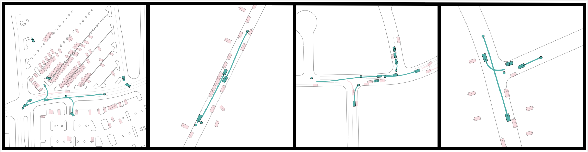
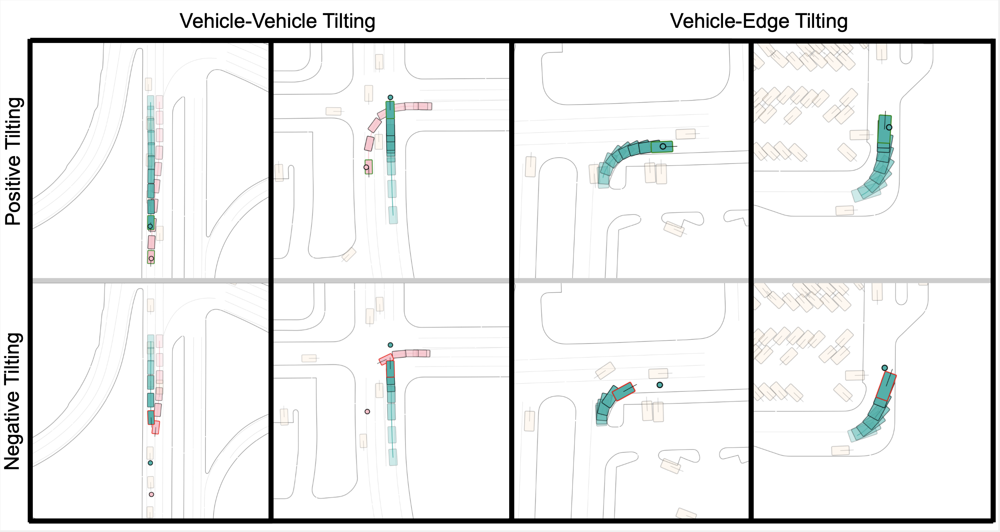
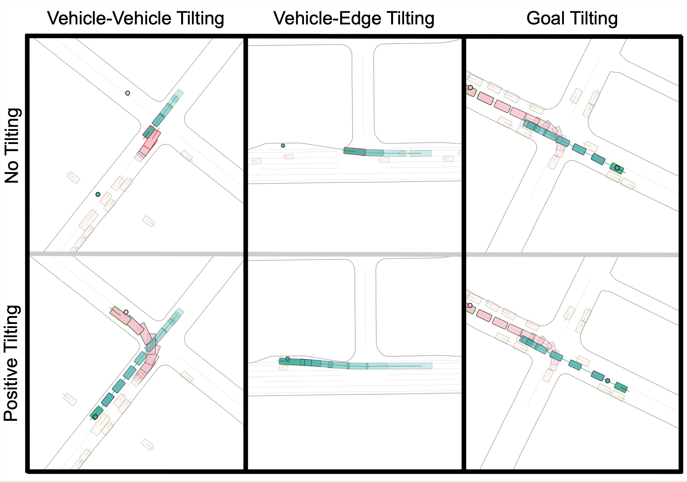

<!-- 
Description
 -->
<!-- <canvas id="canvas">
</canvas>
 -->

 
 

TL;DR: We propose **CtRL-Sim**, a framework that leverages return-conditioned offline reinforcement learning (RL) to enable reactive, closed-loop, and controllable behaviour simulation within a physics-enhanced Nocturne environment. We propose a return-conditioned multi-agent encoder-decoder Transformer architecture within the CtRL- Sim framework to imitate the driving behaviours in a curated offline RL Waymo dataset. We then leverage exponential tilting of the predicted return distribution as a simple yet effective mechanism to control the simulated agent behaviours. CtRL-Sim enables the generation of a wide range of realistic driving behaviours beyond the scope of the initial dataset, including adversarial behaviours for the generation of safety-critical scenarios.

## Demo

  

    

    

      

        
Metric:

        

          
          <input type="radio" class="btn-check" name="btnradio" id="veh" autocomplete="off" checked>
          <label class="btn btn-outline-primary" for="veh">Vehicle-Vehicle</label>

          <input type="radio" class="btn-check" name="btnradio" id="edge" autocomplete="off">
          <label class="btn btn-outline-primary" for="edge">Vehicle-Edge</label>

          <input type="radio" class="btn-check" name="btnradio" id="goal" autocomplete="off">
          <label class="btn btn-outline-primary" for="goal">Vehicle-Goal</label>
        

      

      

        <label for="tiltslider" class="form-label" id="tiltsliderLabel">Tilting: Neutral (default)</label>
      

      

        <input type="range" class="form-range" min="0" max="2" step="1" id="tiltslider">
      

    

    

  

  

    

    

      

        <video id="myvideo" controls autoplay muted>
          <source id="vmp4" src="assets/vids/veh_veh_no_tilt/veh_veh_no_tilt.mp4" type="video/mp4">
          
Your browser does not support this video format.

        </video>
      

    

    

  

## Abstract

Evaluating autonomous vehicle stacks (AVs) in simulation typically involves replaying driving logs from real-world recorded traffic. 
However, agents replayed from offline data do not react to the actions of the AV, and their behaviour cannot be easily controlled to simulate counterfactual scenarios.
Existing approaches have attempted to address these shortcomings by proposing methods that rely on heuristics or learned generative models of real-world data but these approaches either lack realism or necessitate costly iterative sampling procedures to control the generated behaviours.
In this work, we take an alternative approach and propose CtRL-Sim, a method that leverages return-conditioned offline reinforcement learning within a physics-enhanced Nocturne simulator to efficiently generate reactive and controllable traffic agents.
Specifically, we process real-world driving data through the Nocturne simulator to generate a diverse offline reinforcement learning dataset, annotated with various reward terms.
With this dataset, we train a return-conditioned multi-agent behaviour model that allows for fine-grained manipulation of agent behaviours by modifying the desired returns for the various reward components.
This capability enables the generation of a wide range of driving behaviours beyond the scope of the initial dataset, including those representing adversarial behaviours.
We demonstrate that CtRL-Sim can efficiently generate diverse and realistic safety-critical scenarios while providing fine-grained control over agent behaviours. Further, we show that fine-tuning our model on simulated safety-critical scenarios generated by our model enhances this controllability. 

## Examples

CtRL-Sim can faithfully imitate the multi-agent driving behaviours found in the Waymo dataset. The teal agents are controlled by CtRL-Sim, and other agents in pink are set to log-replay. 

Exponential tilting enables control over the generation of realistic vehicle-vehicle and vehicle-edge collision scenarios. We show the evolution of four traffic scenes with the top panels applying positive tilting to the CtRL-Sim-controlled agent (shown in teal) and the bottom panels applying negative tilting to the same CtRL-Sim- controlled agent. Bounding boxes outlined in red contain a traffic violation. All other agents are set to log-replay through physics, with the agent interacting with the CtRL-Sim-controlled agent denoted in pink. Goals are denoted by small circles. 

CtRL-Sim enables control over vehicle-vehicle and vehicle-edge behaviours as well as goal reaching behaviours. Moreover, positive tilting can reduce traffic violations in the generated behaviours.

## Bibtex

    @inproceedings{
      rowe2024ctrlsim,
      title={CtRL-Sim: Reactive and Controllable Driving Agents with Offline Reinforcement Learning},
      author={Luke Rowe and Roger Girgis and Anthony Gosselin and Bruno Carrez and Florian Golemo  and Felix Heide and Liam Paull and Christopher Pal},
      journal={arXiv},
      volume={2403.19918},
      year={2024}
    }
